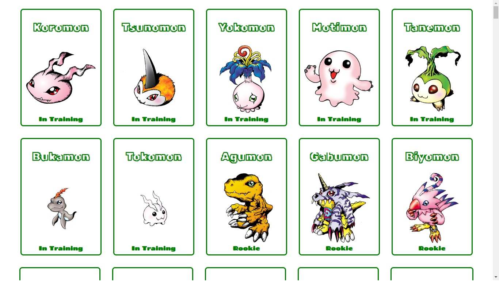
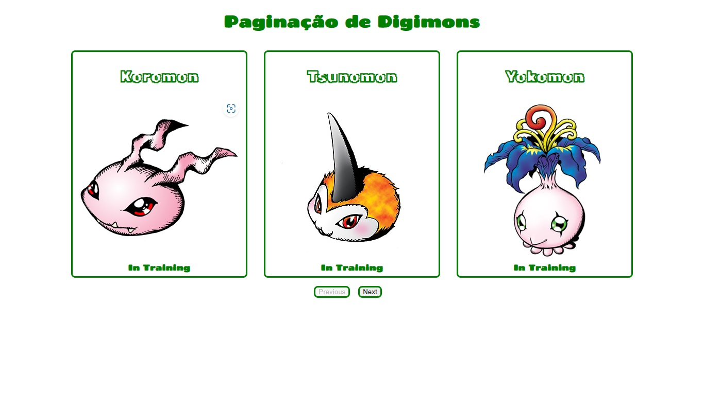

# 💻 Consumindo uma api de digimons. <hr/>
#### Esse é apenas um dos meus estudos de consumo de Api com o useEffect e aplicando paginação. OBS : Ainda nao terminado.<br/><br/>

### Preview <br/><hr/>


<br/> <br/>


<br/> <br/>
<hr/>
### 🛠️ Technologies 
React with type script<br/>
Api-digimon <br/>
React-router-dom<br/>
Styled-components<br/>


## 🧲 Requirements 
Git<br/>
Node.js <br/>
NPM

## Installation

```
$ git clone https://github.com/eltonfreitasx/ApiDigimons.git

$ npm install

$ npm start<br/>
```

The application will open in the browser on http://localhost:5173/

